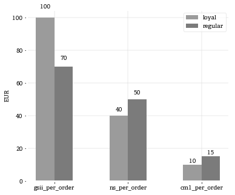

### Grouped bar plot with labels above bar


```python
import pandas as pd
import numpy as np
import matplotlib.pyplot as plt
%matplotlib inline
plt.style.use('bsestyle_light')
```


```python
data = pd.DataFrame({'loyal':[100., 40., 10.], 'regular':[70., 50., 15.]}, index=['gsii_per_order', 'ns_per_order', 'cm1_per_order'])
print data.T
```

             gsii_per_order  ns_per_order  cm1_per_order
    loyal             100.0          40.0           10.0
    regular            70.0          50.0           15.0
    


```python
fig, ax = plt.subplots(1, 1, figsize=(5.5, 4.5))

barwidth = 0.25

for i, col in enumerate(data.columns):
    vals = data[col]
    if i == 0: ind = np.arange(len(vals))
    else: ind = ind + barwidth
    ax.bar(ind, vals, width=barwidth, label=vals.name)

for p, v in zip(ax.patches, list(data.values.T.flat)):
    mid = (p.get_x() + p.get_width()/2) # Find midmpoint of bar
    ax.text(x=mid, y=p.get_height()*1.05, s=np.round(int(v), 0), ha='center', va='bottom')

ind = np.arange(len(data))
pos = ind + barwidth*(len(data.columns) - 1)/2
t = ax.set_xticks(pos)
ax.set_xticklabels(data.index.tolist())
ax.set_ylabel('EUR')
l = ax.legend(loc='upper right')
plt.tight_layout()
```




