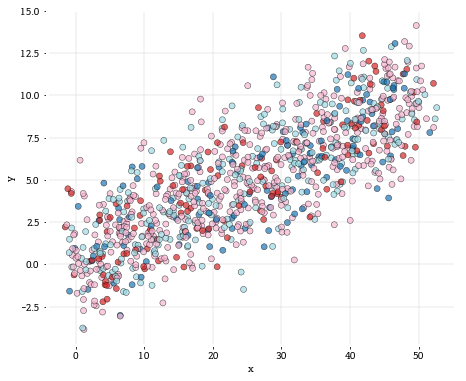

```python
%matplotlib inline
import matplotlib.pyplot as plt
import pandas as pd
import numpy as np
plt.style.use('bsestyle_light.mplstyle')

fig = plt.figure(figsize=(12.4, 5.4))
ax = fig.add_subplot(1, 2, 1)

# Generate random data
n = 1000
mu, sigma = 0,2
x = np.linspace(0,50,n) + np.random.normal(mu, sigma, n)
y = np.linspace(0,10,n) + np.random.normal(mu, sigma, n)
k = np.random.choice([0, 1, 2, 3], size=(1000,), p=[1./8, 1./8, 1./2, 1./4])

# Plot
ax.scatter(x, y, c=k, alpha=0.7, edgecolor='k')
ax.set_xlabel('x')
ax.set_ylabel('y')

plt.tight_layout()
```




